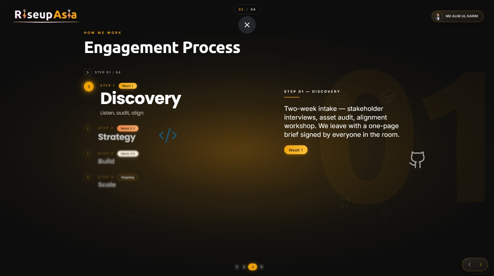
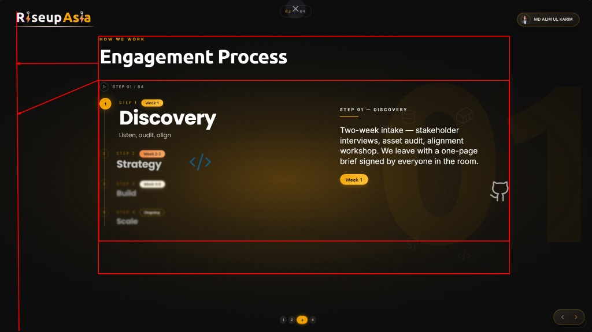

# 12 — Steps Pattern (LLM Pack)

> **Phase 10/20** · The fastest way for any LLM to recognize, author,
> and verify a `StepTimelineSlide`. Deep numbers live in the steps
> spec set: `42-steps-motion.md`, `43-steps-sound.md`,
> `44-steps-accessibility.md`, `45-/46-steps-code-references.md`.

## 1. Visual reference

**Canonical look** (ship this):



**Anti-pattern** (do not ship — kept for contrast):



The annotated overlay (Phase 15) lands at
`assets/step/target-annotated.png` and is referenced from §3 below
once written.

## 2. Visual anatomy

```
┌──────────────────────────────────────────────────────┐
│ EYEBROW  (gold, uppercase, tracking 0.18em)          │
│ Title    (Ubuntu Bold, cream)                        │
│                                                      │
│ ┌─── 560px ────┐ 80gut ┌──── 800px ─────┐            │
│ │  step list   │       │ detail panel   │            │
│ │  ① label     │       │ eyebrow        │            │
│ │  ② label *   │       │ ─── 56px gold  │            │
│ │  ③ label     │       │ description    │            │
│ │              │       │ capsule        │            │
│ └──────────────┘       └────────────────┘            │
│ ▶  STEP 02 / 04                                      │
└──────────────────────────────────────────────────────┘
```

- **Vertical gold connector** at `left: 18px` of the list column,
  `width: 1px`, `bg-gold/20`. Active fill is solid `--gold` with
  `0_0_8px_hsl(var(--gold)/0.6)` shadow.
- **Numbered chip** is a 36×36 rounded-full button — never a `div`.
- **Right-side detail panel** is a single panel; `hoveredIndex`
  overrides `active` for the panel only. Connector + chip glow follow
  `active`.
- **Counter pill** (`STEP NN / NN`) sits to the right of the icon-only
  Play / Pause control.

## 3. Active vs. inactive treatment

| State | Title size | Title color | Opacity | Description |
|---|---|---|---|---|
| Active | `clamp(3rem, 5vw, 4.75rem)` | `#FFFFFF` | `1.0` | Visible in panel |
| Adjacent | `clamp(1.75rem, 2.4vw, 2.25rem)` | `#FFFFFF / 0.75` | `0.55` | Eyebrow + title only |
| Far | `clamp(1.25rem, 1.7vw, 1.625rem)` | `#FFFFFF / 0.55` | `0.30` | Eyebrow + title only |

**Depth without scale.** The font-size jump + opacity ramp + pure-white
active title carry depth. `transform: scale()` on rows is **forbidden**
(it blurs glyphs).

## 4. Removed (do not bring back)

- The full progress-bar banner with the gold pill + filled bar
  (replaced by the small counter).
- `.step-row-pop-a` / `.step-row-pop-b` keyframes.
- `--step-scale-active/-adjacent/-far` tokens.
- An always-visible inline description under each row (the side panel
  is the only description surface).

## 5. Author JSON shape

```json
{
  "slideType": "StepTimelineSlide",
  "title": "Our process",
  "showBrandHeader": true,
  "steps": [
    { "eyebrow": "Step 1", "title": "Discovery",
      "description": "Listen, audit, align.",
      "capsule": { "kind": "outline", "label": "Week 1" } }
  ]
}
```

## 6. Hand-off to deeper specs

| For | Read |
|---|---|
| Motion numbers, enums, reduced-motion | `spec/slides/42-steps-motion.md` |
| Sound triggers, asset table, debounce | `spec/slides/43-steps-sound.md` |
| WCAG ratios, ARIA, keyboard contract | `spec/slides/44-steps-accessibility.md` |
| Code-shape snippets | `spec/slides/45-/46-steps-code-references.md` |

## 7. Acceptance & changelog

- Active title pure white at active token; adjacent rows smaller; no blur.
- Side panel shows only the active (or hovered) row's description.
- Counter pill reads `NN / NN` and updates with focus.
- 2026-04-26 (v0.80.4): Phase 10 — embedded reference + anti-pattern.
